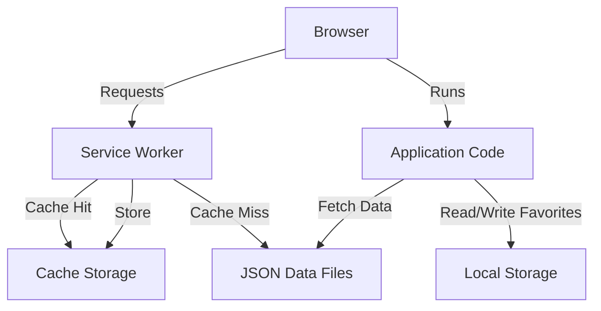

# Design Document: Radical Red Dex PWA

## Overview

The Radical Red Dex PWA is a client-side Progressive Web App that provides a comprehensive Pokédex for the Radical Red ROM hack. The application is designed to work completely offline after initial load, be installable on mobile devices (particularly iOS via Safari), and run as static files on GitHub Pages without any backend infrastructure.

### Core Design Principles

1. **Offline-First Architecture**: All functionality must work without network connectivity after initial load
2. **Zero Backend Dependency**: Pure client-side application using only HTML, CSS, and vanilla JavaScript
3. **Mobile-First Design**: Optimized for mobile devices with responsive layouts
4. **Performance Priority**: Minimal DOM manipulation, efficient data loading, and fast rendering
5. **Simplicity**: No frameworks, no build tools, no complex abstractions

### Key Technical Constraints

- Must work on GitHub Pages (static file hosting)
- Must be installable on iOS Safari via "Add to Home Screen"
- Must use vanilla JavaScript (no frameworks)
- Must cache all resources for offline use
- Must handle missing or malformed data gracefully

## Architecture

### High-Level Architecture

The application follows a simple three-layer architecture:

```
┌─────────────────────────────────────────┐
│         Presentation Layer              │
│  (DOM Manipulation & Event Handling)    │
└─────────────────────────────────────────┘
                  ↓
┌─────────────────────────────────────────┐
│         Application Layer               │
│  (Business Logic & State Management)    │
└─────────────────────────────────────────┘
                  ↓
┌─────────────────────────────────────────┐
│         Data Layer                      │
│  (JSON Loading & Caching)               │
└─────────────────────────────────────────┘
```

### PWA Architecture Components



### Service Worker Strategy

The service worker implements a **Cache-First** strategy:

1. **Installation Phase**: Cache all static assets (HTML, CSS, JS) and JSON data files
2. **Activation Phase**: Clean up old caches when version changes
3. **Fetch Phase**: Serve from cache first, fall back to network if cache miss

**Cache Versioning**: Use a version string (e.g., `v1`) to manage cache updates. When the version changes, old caches are deleted.

### Application State Management

The application maintains state in memory during the session:

- **Loaded Data**: All JSON files loaded once at startup and stored in memory
- **Current View**: Track whether user is on home screen or detail view
- **Search State**: Current search query and filtered results
- **Favorites**: Stored in localStorage, loaded at startup

### Navigation Model

Simple two-screen navigation:

```
Home Screen ←→ Detail View
```

Navigation is handled via:
- URL hash changes (e.g., `#pokemon/25` for Pikachu)
- Back button support via hash navigation
- Direct linking to specific Pokémon

## Components and Interfaces

### 1. Service Worker (`service-worker.js`)

**Purpose**: Enable offline functionality and resource caching

**Key Functions**:

```javascript
// Install event - cache all resources
self.addEventListener('install', (event) => {
  // Cache static assets and JSON files
});

// Activate event - clean up old caches
self.addEventListener('activate', (event) => {
  // Remove outdated caches
});

// Fetch event - serve from cache
self.addEventListener('fetch', (event) => {
  // Cache-first strategy
});
```

**Responsibilities**:
- Cache all static assets on install
- Cache all JSON data files on install
- Serve cached resources on fetch requests
- Handle cache versioning and cleanup
- Provide fallback for cache misses

**Interface**:
- Input: Fetch requests from the browser
- Output: Cached responses or network responses

### 2. Data Manager Module

**Purpose**: Load, validate, and provide access to JSON data

**Key Functions**:

```javascript
const DataManager = {
  data: {},
  
  async loadAllData() {
    // Load all JSON files into memory
  },
  
  getSpecies(id) {
    // Get species data with null checks
  },
  
  getMove(id) {
    // Get move data with null checks
  },
  
  getAbility(id) {
    // Get ability data with null checks
  },
  
  // ... other data accessors
};
```

**Responsibilities**:
- Load all JSON files at application startup
- Store data in memory for fast access
- Validate data and handle missing fields
- Provide safe accessor methods with null checks
- Handle loading errors gracefully

**Data Files to Load**:
- species.json
- moves.json
- abilities.json
- items.json
- trainers.json
- tmMoves.json
- tutorMoves.json
- types.json
- areas.json
- natures.json
- eggGroups.json
- splits.json
- evolutions.json
- scaledLevels.json
- caps.json
- sprites.json

### 3. Favorites Manager Module

**Purpose**: Manage user's favorite Pokémon using localStorage

**Key Functions**:

```javascript
const FavoritesManager = {
  favorites: new Set(),
  
  load() {
    // Load favorites from localStorage
  },
  
  save() {
    // Save favorites to localStorage
  },
  
  toggle(pokemonId) {
    // Add or remove favorite
  },
  
  isFavorite(pokemonId) {
    // Check if Pokémon is favorited
  }
};
```

**Responsibilities**:
- Load favorites from localStorage on startup
- Persist favorites to localStorage on changes
- Provide methods to check and toggle favorite status
- Handle localStorage errors gracefully

**Storage Format**:
```javascript
// localStorage key: 'radical-red-favorites'
// Value: JSON array of Pokémon IDs
["1", "25", "150"]
```

### 4. View Manager Module

**Purpose**: Handle navigation and view rendering

**Key Functions**:

```javascript
const ViewManager = {
  currentView: 'home',
  
  init() {
    // Initialize navigation and hash change listeners
  },
  
  showHome() {
    // Render home screen
  },
  
  showDetail(pokemonId) {
    // Render detail view
  },
  
  handleHashChange() {
    // Parse URL hash and navigate
  }
};
```

**Responsibilities**:
- Initialize navigation system
- Listen for hash changes
- Route to appropriate view
- Manage view transitions

**URL Hash Format**:
- Home: `#` or `#home`
- Detail: `#pokemon/{id}` (e.g., `#pokemon/25`)

### 5. Home Screen Component

**Purpose**: Display search bar and Pokémon list

**Key Functions**:

```javascript
const HomeScreen = {
  searchQuery: '',
  filteredPokemon: [],
  
  render() {
    // Render search bar and Pokémon list
  },
  
  handleSearch(query) {
    // Filter Pokémon based on search query
  },
  
  renderPokemonList(pokemon) {
    // Render list with minimal DOM updates
  },
  
  handlePokemonClick(id) {
    // Navigate to detail view
  }
};
```

**Responsibilities**:
- Render search input
- Filter Pokémon based on search query
- Display filtered Pokémon list
- Show favorite indicators
- Handle Pokémon selection
- Optimize rendering for performance

**Search Logic**:
- Case-insensitive matching
- Match against Pokémon name and ID
- Real-time filtering as user types
- Use debouncing if performance issues arise

**List Item Format**:
```html
<div class="pokemon-item" data-id="{id}">
  <span class="pokemon-id">#{id}</span>
  <span class="pokemon-name">{name}</span>
  <span class="favorite-indicator">★</span>
</div>
```

### 6. Detail View Component

**Purpose**: Display comprehensive Pokémon information

**Key Functions**:

```javascript
const DetailView = {
  currentPokemon: null,
  
  render(pokemonId) {
    // Render all Pokémon details
  },
  
  renderBasicInfo() {
    // Name, sprite, types
  },
  
  renderStats() {
    // Base stats display
  },
  
  renderAbilities() {
    // Abilities list
  },
  
  renderEvolutions() {
    // Evolution chain
  },
  
  renderMoves() {
    // Move list
  },
  
  handleFavoriteToggle() {
    // Toggle favorite status
  },
  
  handleBack() {
    // Navigate back to home
  }
};
```

**Responsibilities**:
- Load and display Pokémon data
- Render sprite image
- Display types with appropriate styling
- Show base stats
- List abilities with descriptions
- Display evolution information
- Show move list
- Handle favorite toggle
- Provide back navigation

**Detail View Sections**:
1. Header: Name, ID, favorite button, back button
2. Sprite: Pokémon image
3. Types: Type badges
4. Stats: Base stats (HP, Attack, Defense, Sp. Atk, Sp. Def, Speed)
5. Abilities: List of abilities with descriptions
6. Evolutions: Evolution chain information
7. Moves: Simplified move list

### 7. UI Utilities Module

**Purpose**: Provide reusable UI helper functions

**Key Functions**:

```javascript
const UIUtils = {
  createElement(tag, className, content) {
    // Create DOM element with class and content
  },
  
  clearElement(element) {
    // Remove all children from element
  },
  
  showError(message) {
    // Display error message to user
  },
  
  getTypeColor(type) {
    // Return color for Pokémon type
  },
  
  formatStatName(stat) {
    // Format stat name for display
  }
};
```

**Responsibilities**:
- Provide DOM manipulation helpers
- Handle error display
- Provide type color mapping
- Format data for display

## Data Models

### Species Data Model

```javascript
{
  "id": "1",
  "name": "Bulbasaur",
  "types": ["Grass", "Poison"],
  "baseStats": {
    "hp": 45,
    "attack": 49,
    "defense": 49,
    "spAttack": 65,
    "spDefense": 65,
    "speed": 45
  },
  "abilities": ["Overgrow", "Chlorophyll"],
  "evolutions": [
    {
      "species": "Ivysaur",
      "level": 16
    }
  ],
  "moves": [
    {
      "move": "Tackle",
      "level": 1
    },
    {
      "move": "Vine Whip",
      "level": 7
    }
  ],
  "sprite": "path/to/sprite.png"
}
```

**Required Fields**: id, name
**Optional Fields**: All others (must handle missing fields)

### Move Data Model

```javascript
{
  "id": "1",
  "name": "Pound",
  "type": "Normal",
  "category": "Physical",
  "power": 40,
  "accuracy": 100,
  "pp": 35,
  "description": "A physical attack..."
}
```

### Ability Data Model

```javascript
{
  "id": "1",
  "name": "Overgrow",
  "description": "Powers up Grass-type moves when HP is low."
}
```

### Favorites Data Model

```javascript
{
  "favorites": ["1", "25", "150"]
}
```

Stored in localStorage under key `radical-red-favorites`.

### Application State Model

```javascript
{
  "currentView": "home" | "detail",
  "currentPokemonId": "25",
  "searchQuery": "pika",
  "loadedData": {
    "species": {...},
    "moves": {...},
    "abilities": {...},
    // ... other data
  },
  "favorites": Set(["1", "25", "150"])
}
```

### Cache Model

Service Worker cache structure:

```javascript
{
  "cache-v1": [
    "/",
    "/index.html",
    "/style.css",
    "/script.js",
    "/manifest.json",
    "/data/species.json",
    "/data/moves.json",
    // ... all other resources
  ]
}
```

### Manifest Model

```json
{
  "name": "Radical Red Dex",
  "short_name": "RR Dex",
  "description": "Pokédex for Radical Red",
  "start_url": "/",
  "display": "standalone",
  "background_color": "#000000",
  "theme_color": "#ff0000",
  "icons": [
    {
      "src": "/icons/icon-192.png",
      "sizes": "192x192",
      "type": "image/png"
    },
    {
      "src": "/icons/icon-512.png",
      "sizes": "512x512",
      "type": "image/png"
    }
  ]
}
```


## Correctness Properties

*A property is a characteristic or behavior that should hold true across all valid executions of a system—essentially, a formal statement about what the system should do. Properties serve as the bridge between human-readable specifications and machine-verifiable correctness guarantees.*

### Property 1: Offline Resource Serving

*For any* cached resource request when the application is offline, the service worker should return the resource from cache storage rather than attempting a network request.

**Validates: Requirements 2.5**

### Property 2: Missing Field Graceful Handling

*For any* JSON data object with missing or undefined fields, the application should handle the access gracefully without throwing errors, using default values or skipping the field as appropriate.

**Validates: Requirements 3.3, 11.1**

### Property 3: Search Filtering Correctness

*For any* search query string, the displayed Pokémon list should contain only Pokémon whose name or ID matches the query (case-insensitive), and all matching Pokémon should be included.

**Validates: Requirements 4.3**

### Property 4: Navigation to Detail View

*For any* Pokémon in the home screen list, clicking on that Pokémon should navigate to the detail view displaying that specific Pokémon's information.

**Validates: Requirements 4.4**

### Property 5: Detail View Completeness

*For any* Pokémon with available data, the detail view should display all required information fields including name, sprite, types, base stats, abilities, evolution information, and move list.

**Validates: Requirements 5.1, 5.2, 5.3, 5.4, 5.5, 5.6, 5.7**

### Property 6: Favorites Persistence Round-Trip

*For any* Pokémon marked as favorite, saving the favorites to localStorage and then loading them back should preserve the favorite status for that Pokémon.

**Validates: Requirements 6.2, 6.3**

### Property 7: Favorites Display Indicator

*For any* Pokémon that is marked as favorite, the home screen list should display a visual indicator (such as a star icon) next to that Pokémon.

**Validates: Requirements 6.5**

### Property 8: Relative Path Usage

*For any* resource reference in the application code (HTML, CSS, JavaScript), the path should be relative rather than absolute, ensuring compatibility with different hosting environments.

**Validates: Requirements 8.5**

### Property 9: Error-Free Execution

*For any* user interaction or data operation, the application should not produce uncaught errors that break console execution or crash the application.

**Validates: Requirements 11.3**

## Error Handling

### Error Categories

The application must handle three categories of errors:

1. **Data Loading Errors**: JSON files fail to load or are malformed
2. **Runtime Errors**: Missing data fields, null references, invalid operations
3. **Service Worker Errors**: Cache failures, registration failures

### Error Handling Strategies

**Data Loading Errors**:
- Wrap all fetch operations in try-catch blocks
- Display user-friendly error messages (e.g., "Failed to load Pokémon data. Please refresh the page.")
- Prevent application crash by providing empty data structures as fallbacks
- Log errors to console for debugging

**Runtime Errors**:
- Use null checks before accessing nested object properties
- Provide default values for missing fields (e.g., "Unknown" for missing names)
- Use optional chaining (`?.`) where supported
- Validate data before rendering

**Service Worker Errors**:
- Graceful degradation: If service worker fails to register, app still works online
- Cache failures should fall back to network requests
- Display error messages for cache-related issues
- Don't block application startup on service worker registration

### Error Display

Error messages should be:
- User-friendly and non-technical
- Displayed in a visible but non-intrusive manner
- Dismissible by the user
- Logged to console with technical details for debugging

Example error display:
```html
<div class="error-message">
  <span class="error-icon">⚠️</span>
  <span class="error-text">Failed to load data. Please check your connection and refresh.</span>
  <button class="error-dismiss">×</button>
</div>
```

### Validation Rules

**Species Data Validation**:
- Required: `id`, `name`
- Optional: All other fields
- Default values: Empty arrays for lists, "Unknown" for missing strings, 0 for missing numbers

**Move Data Validation**:
- Required: `id`, `name`
- Optional: All other fields
- Default values: "—" for missing descriptions, 0 for missing power/accuracy

**Ability Data Validation**:
- Required: `id`, `name`
- Optional: `description`
- Default values: "No description available" for missing descriptions

## Testing Strategy

### Dual Testing Approach

The application will use both unit testing and property-based testing to ensure comprehensive coverage:

**Unit Tests**: Verify specific examples, edge cases, and error conditions
- Specific Pokémon data rendering
- Error handling scenarios
- UI component existence
- File structure validation
- Manifest configuration values

**Property Tests**: Verify universal properties across all inputs
- Search filtering with random queries
- Detail view rendering for random Pokémon
- Favorites persistence with random sets
- Missing field handling with random malformed data
- Navigation behavior across all Pokémon

### Property-Based Testing Configuration

**Testing Library**: Use **fast-check** for JavaScript property-based testing

**Configuration Requirements**:
- Minimum 100 iterations per property test (to ensure comprehensive random input coverage)
- Each property test must include a comment tag referencing the design document property
- Tag format: `// Feature: radical-red-dex-pwa, Property {number}: {property_text}`

**Example Property Test Structure**:
```javascript
// Feature: radical-red-dex-pwa, Property 3: Search Filtering Correctness
fc.assert(
  fc.property(fc.string(), (searchQuery) => {
    const results = filterPokemon(searchQuery);
    // Assert all results match the query
    // Assert no matching Pokémon are excluded
  }),
  { numRuns: 100 }
);
```

### Unit Testing Focus Areas

Unit tests should focus on:

1. **Specific Examples**:
   - Rendering Bulbasaur's detail view
   - Searching for "Pikachu"
   - Toggling favorite on Charizard

2. **Edge Cases**:
   - Empty search query
   - Pokémon with no evolutions
   - Pokémon with missing sprite
   - Empty favorites list

3. **Error Conditions**:
   - Failed JSON loading
   - Malformed JSON data
   - Service worker registration failure
   - Cache miss scenarios

4. **Integration Points**:
   - Service worker installation
   - localStorage read/write
   - Hash navigation
   - DOM event handling

5. **Configuration Validation**:
   - Manifest file structure
   - File locations
   - Cache version format

### Testing Tools

- **Unit Testing**: Jest or Mocha for JavaScript unit tests
- **Property Testing**: fast-check for property-based tests
- **DOM Testing**: jsdom for DOM manipulation tests
- **Service Worker Testing**: Mock service worker for offline testing

### Test Organization

```
tests/
  unit/
    data-manager.test.js
    favorites-manager.test.js
    view-manager.test.js
    home-screen.test.js
    detail-view.test.js
    ui-utils.test.js
  property/
    search-filtering.property.test.js
    detail-view-rendering.property.test.js
    favorites-persistence.property.test.js
    error-handling.property.test.js
  integration/
    service-worker.test.js
    offline-functionality.test.js
    navigation.test.js
```

### Coverage Goals

- Unit test coverage: 80%+ for business logic
- Property test coverage: All 9 correctness properties implemented
- Integration test coverage: All critical user flows (search, view details, toggle favorites, offline usage)

### Manual Testing Requirements

Some requirements require manual testing on actual devices:
- iOS Safari "Add to Home Screen" functionality (Requirement 1.6)
- Offline functionality on mobile devices (Requirement 2.4)
- GitHub Pages deployment (Requirement 8.4)
- Responsive design on various screen sizes (Requirement 7.3)

These should be tested as part of the deployment process but cannot be automated in the test suite.
